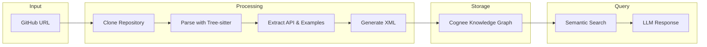

---
hide:
  - navigation
  - toc
---

<div class="hero" markdown>

# Pygrad

**Build searchable knowledge graphs from Python repository documentation**

Transform any Python repository into an AI-powered documentation assistant using Graph RAG technology.

[Get Started](getting-started/index.md){ .md-button .md-button--primary }
[View on GitHub](https://github.com/pygrad/pygrad){ .md-button }

</div>

---

## Features

<div class="grid" markdown>

<div class="card" markdown>

### :material-graph: Knowledge Graph

Automatically builds a semantic knowledge graph from Python source code, connecting classes, methods, functions, and usage examples.

</div>

<div class="card" markdown>

### :material-magnify: Semantic Search

Ask natural language questions about any Python library and get accurate, contextual answers with code examples.

</div>

<div class="card" markdown>

### :material-code-braces: Tree-sitter Parsing

Fast and accurate AST parsing extracts classes, functions, docstrings, and type annotations from Python code.

</div>

<div class="card" markdown>

### :material-file-document: Usage Examples

Automatically mines real usage examples from test files, notebooks, and example directories.

</div>

<div class="card" markdown>

### :material-server: Local LLM Support

Works with Ollama and other local LLM providers for privacy-conscious deployments.

</div>

<div class="card" markdown>

### :material-api: Simple API

Numpy-style API that's easy to learn and use: `pg.add()`, `pg.search()`, `pg.list()`.

</div>

</div>

---

## Quick Start

=== "Python"

    ```python
    import pygrad as pg

    # Index a repository
    await pg.add("https://github.com/pydantic/pydantic")

    # Ask questions about it
    result = await pg.search(
        "https://github.com/pydantic/pydantic",
        "How do I validate email addresses?"
    )
    print(result)
    ```

=== "CLI"

    ```bash
    # Index a repository
    pygrad add https://github.com/pydantic/pydantic

    # Ask questions
    pygrad ask https://github.com/pydantic/pydantic "How to validate emails?"

    # List indexed repositories
    pygrad list
    ```

---

## How It Works



1. **Clone**: Downloads the repository (shallow clone for speed)
2. **Parse**: Uses Tree-sitter to extract classes, functions, and docstrings
3. **Extract**: Finds usage examples from tests and example files
4. **Generate**: Creates structured API documentation in XML format
5. **Index**: Builds a knowledge graph using Cognee
6. **Search**: Answers questions using semantic search and LLM generation

---

## Installation

```bash
pip install pygrad
```

For development:

```bash
pip install pygrad[dev]
```

---

## Use Cases

- **Learning new libraries**: Quickly understand how to use unfamiliar Python packages
- **API documentation**: Generate searchable documentation from any codebase
- **Code exploration**: Ask questions about large codebases
- **Developer onboarding**: Help new team members understand internal libraries
- **Research**: Analyze patterns across multiple repositories

---

## License

Pygrad is released under the [BSD 3-Clause License](https://opensource.org/licenses/BSD-3-Clause).
